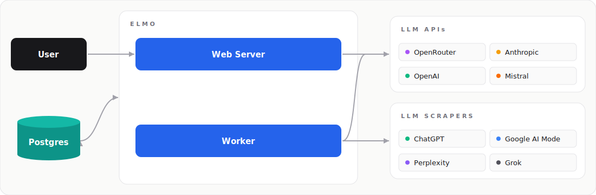

<p align="center">
  <a href="https://github.com/elmohq/elmo">
    
  </a>
</p>

<p align="center">
  Open source AI visibility tracking and optimization.
  <br />
  <br />
  <a href="https://www.elmohq.com/"><strong>Learn more »</strong></a>
</p>

<br />

<p align="center">
  <a href="https://www.elmohq.com/docs"></a>&nbsp;
  <a href="https://demo.elmohq.com"></a>&nbsp;
  <a href="https://github.com/elmohq/elmo/issues"></a>&nbsp;
  <a href="https://github.com/orgs/elmohq/projects/3/views/1"></a>&nbsp;
  <a href="https://discord.gg/s24nubCtKz"></a>
</p>

<br />

## About

Elmo is an open-source, self-hosted platform for optimizing your AI visibility, which is also known as:
* Answer Engine Optimization (AEO)
* Generative Engine Optimization (GEO)
* LLM Optimization (LLMO, which is where the name Elmo is from)

Elmo tracks how AI answer engines like ChatGPT, Claude, Perplexity, Gemini, and Google AI Overviews mention, cite, and describe your brand, so you can benchmark competitors and grow your visibility in AI answers.

It's a free alternative to tools like [Profound](https://www.elmohq.com/ai-visibility-tools/profound), [Peec](https://www.elmohq.com/ai-visibility-tools/peec-ai), and [Otterly](https://www.elmohq.com/ai-visibility-tools/otterly-ai). You can run it on your own infrastructure, own your data, and audit exactly how every metric is calculated.

## Demo

Try the live demo at **[demo.elmohq.com](https://demo.elmohq.com)** to see how Elmo tracks prompts and analyzes citations.

## Quick Start

For local deployments, use Docker Compose as configured with the `@elmohq/cli` package:

```bash
# Install the CLI globally
npm install -g @elmohq/cli

# Initialize configuration (interactive wizard)
elmo init

# Start the stack
elmo compose up -d
```

> [!TIP]
> **Watch** this repo's **releases** to get notified of major updates.

## Architecture

<p align="center">
  
</p>

## Tech Stack

- [Docker Compose](https://docs.docker.com/compose/)
- [PostgreSQL](https://www.postgresql.org/)
- [TypeScript](https://www.typescriptlang.org/)
- [TanStack Start](https://tanstack.com/start/latest)
- [pg-boss](https://github.com/timgit/pg-boss)

## Contact

- [Discord](https://discord.gg/s24nubCtKz)
- [Email](mailto:support@elmohq.com)
- [Schedule a call](https://cal.com/jrhizor/elmo)

## Repo Activity


