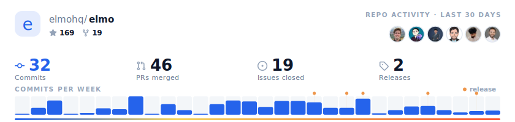
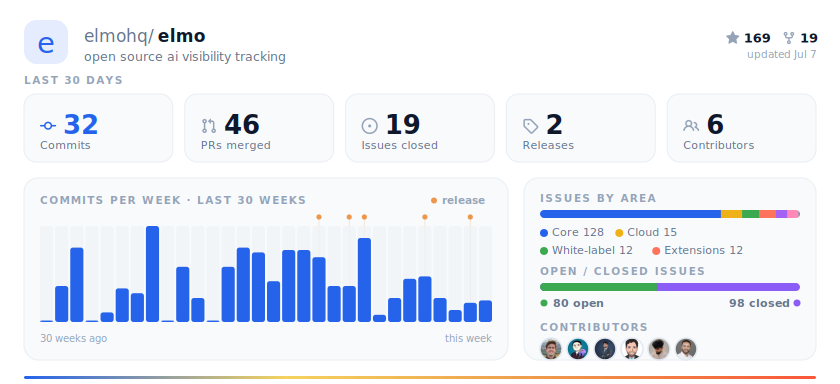
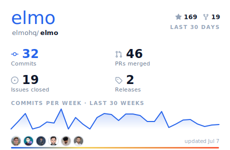

# Repo-activity SVG — options for review

A self-hosted, brand-matched replacement for the [Repobeats](https://repobeats.axiom.co)
embed in the root `README.md`. Served dynamically from **`apps/www`** at:

```
https://www.elmohq.com/api/repobeats.svg?variant=<pulse|dashboard|card>&theme=<light|dark|auto>
```

- **Caches in Upstash** with a 5-minute stale-while-revalidate window (serves the
  last-good snapshot if GitHub errors, so the image never breaks).
- **Filters out bots** (dependabot, blacksmith, github-actions, …) from contributors.
- **Matches elmo branding** — Titan One wordmark, brand blue `#2563eb`, the accent
  gradient, and the product chart palette.

The SVGs below are **static snapshots** committed only so the options can be reviewed
in this PR. They adapt to your GitHub theme (light/dark). Once a variant is chosen we
point the root README at the live endpoint and can delete the rest.

---

## Option A — Pulse `?variant=pulse`

A wide, short activity strip — the closest 1:1 replacement for the current embed.



## Option B — Dashboard `?variant=dashboard`

The richest snapshot: KPI tiles, a hero commit chart with release markers, and an
insights panel (issues by area, open/closed split, contributors).



## Option C — Card `?variant=card`

A compact, brand-forward badge sized for a sidebar column.



---

### All rendered files

| Variant | Light | Dark | Auto (theme-adaptive) |
| --- | --- | --- | --- |
| Pulse | [pulse-light.svg](./pulse-light.svg) | [pulse-dark.svg](./pulse-dark.svg) | [pulse-auto.svg](./pulse-auto.svg) |
| Dashboard | [dashboard-light.svg](./dashboard-light.svg) | [dashboard-dark.svg](./dashboard-dark.svg) | [dashboard-auto.svg](./dashboard-auto.svg) |
| Card | [card-light.svg](./card-light.svg) | [card-dark.svg](./card-dark.svg) | [card-auto.svg](./card-auto.svg) |

`_snapshot.json` is the underlying GitHub data (avatars redacted) for reference.

### What each shows

- **KPIs (last 30 days):** commits, PRs merged, issues closed, releases, contributors.
- **Commit activity:** per-week commits for the last 30 weeks, with release markers.
- **Contributors:** human contributors only, avatars inlined as `data:` URIs.
- **Issues by area** (Dashboard): `area/*` label distribution — `bug`/`enhancement`/
  `documentation` are unused on this repo, so the meaningful area split is shown instead.
- **Open / closed issues** (Dashboard): all-time ratio.

### Regenerating

```bash
GITHUB_TOKEN=$(gh auth token) pnpm --filter @workspace/www generate-repobeats
```

### Notes

- `GITHUB_TOKEN` is optional but recommended in production (same convention as the
  existing `github-roadmap.ts` / `github-changelog.ts`). Without it, the stars, commit
  chart, contributors and releases still work; the Search-API KPIs (PRs merged, issues
  closed, open/closed totals, per-area counts) need it to be exact.
- Theme-adaptive (`theme=auto`) uses a `prefers-color-scheme` `@media` block inside the
  SVG, which GitHub honours when it renders the README image.
